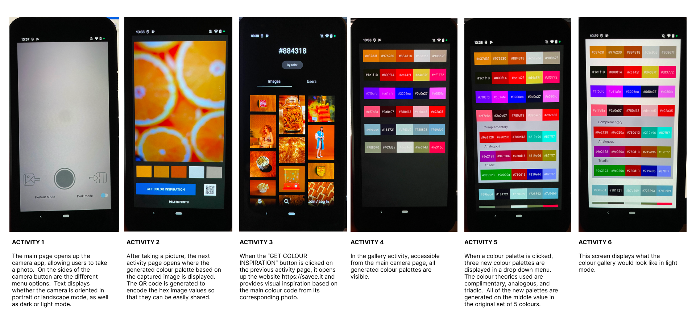

# Colour-Palette-Generator-Mobile-Application
FORMA: Colour Palette Generator | Mobile Computing Final Project
By Kathy Lee, Neal Sison

# Project Overview
Forma is an application developed to assist designers and artists alike to be more inspired by the real-life environments they surround themselves in. Forma will create colour pallets of different colour harmonies based on the photos taken by users within the application. The standard colour pallet that would be extracted from the selected photo would be of the five most prominent and distinctly different colours. The supplementary colour harmonies would be then generated in reference to the 3rd colour from the original pallet. Users will also be able to get further inspiration and view images that utilize a colour within the colour pallet via saave.it/search. Additionally, each colour pallet will generate its own unique QR code so that sharing colour pallets between friends can be made easier!
